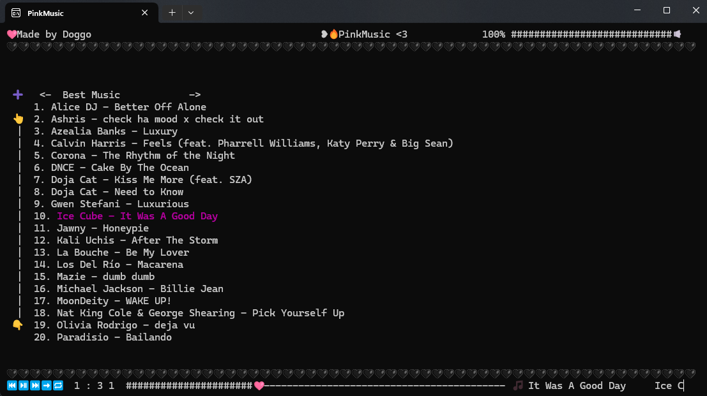

# 🎵 PinkMusic

**PinkMusic** is a minimalist, console-based FLAC music player with a custom user interface built on the Windows Console API. It supports playlist management, interactive UI elements (like sliders, buttons, and menus), and a responsive event-driven system using SFML for audio playback.



---

## ✨ Features

- 🎼 Load and play `.flac` music files from directories
- 🔁 Shuffle and loop functionality
- 🖱️ Mouse-driven interactive UI with:
  - Buttons
  - Sliders
  - Menus
  - Animated and moving text
- ⌨️ Keyboard event handling for full control
- 🪟 UTF-8 console rendering with real-time updates

---

## 🛠️ Technologies Used

- **C++17**
- **SFML Audio Module**
- **Windows Console API**
- Custom-built UI layer (`dUI`) for event management and rendering

---

## 🧩 Project Structure

```

PinkMusic/
├── dMusic.hpp / dMusic.cpp   # Music player & playlist logic
├── dUI.hpp / dUI.cpp         # Custom UI framework (sliders, buttons, rendering)
├── PinkMusic.cpp             # Entry point (not provided here)
└── README.md                 # This file

````

---

## 🚀 Getting Started

### 🧱 Prerequisites

- Windows OS (Console API is Windows-specific)
- C++17-compatible compiler (MSVC recommended)
- SFML 2.5+ (Audio module required)


### ▶️ Running

```bash
./PinkMusic
```

* The program automatically loads `.flac` files from the provided folder into a playlist.
* UI elements such as sliders and buttons will appear in the console for interaction.

---

## 🧪 UI Overview

* **Buttons**: Trigger actions like play/pause, next, or quit
* **Sliders**: Control playback or volume visually with dragging
* **Menus**: Hover or click to interact with sections
* **Moving Text**: Scroll long track names smoothly
* **Key Events**: Bind actions to keyboard inputs

---

## 📁 Example: Creating a Playlist

Simply pass the folder path containing `.flac` files:

The player will:

1. Extract all `.flac` file paths
2. Queue them into a `Playlist`
3. Start interactive console UI

---

## ⚙️ Settings & Flags

| Feature      | Default  | Configurable?  |
| ------------ | -------- | -------------- |
| Shuffle      | `false`  | ✅ Runtime      |
| Looping      | `false`  | ✅ Runtime      |
| Audio Format | `.flac`  | ❌ Hardcoded    |
| FPS Cap      | `60` FPS | ✅ (`fpsCap()`) |

---

## 🧑‍💻 Contributing

Got ideas to improve the UI or add streaming support?

1. Fork the repo
2. Create a feature branch
3. Submit a pull request

We'd love your help!

---

## 📝 License

This project is open-source under the MIT License.

---

## 🙌 Acknowledgments

* [SFML](https://www.sfml-dev.org/) – Simple and Fast Multimedia Library
* Windows Console API documentation
* All contributors, testers, and music lovers ❤️
